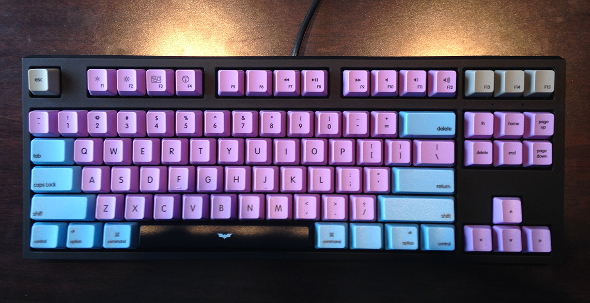

     Mac Layout file for custom WASD Keyboard.
     
     Font & vector (Adobe Illustrator) file included.
     
     The keyboard has DIP switch on the bottom that let's you switch position of 'command' & 'option' keys. You can also take out hte key physicaly andd change it's location. Or even better just adjust template file to your needs :)
     
     If you want to have media keys working like 'default' Mac keys - use KeyRemap4Macbook app.